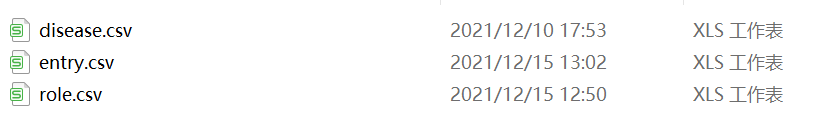

# 厌食症知识图谱构建
## 文件

### 实体表

| 文件（.csv） | 解释     |
| ------------ | -------- |
| diease       | 疾病     |
| entry        | 其他项目 |

### 关系表

| 文件（.csv） | 解释     |
| ------------ | -------- |
| role         | 限定关系 |

## 实体设置
|实体名称|描述|
| ------------ | -------- |
| Check        | 检查项目 |
| Department   | 科室     |
| Drug         | 药品     |
| Disease      | 疾病     |
| Food         | 食物     |
| Symptom      | 症状     |
| Crowd        | 人群     |
| Part         | 身体部位 |
| Hospital | 医院 |
| Article | 文章 |
| Cause | 病因 |
| Crue | 治疗方式 |
| Prevention | 预防方式 |

## 关系设置

| 关系名称           | 解释                               |
| ------------------ | ---------------------------------- |
| include            | 包括（疾病之间）                   |
| include            | 包括（药品之间）                   |
| include            | 包括（食物之间）                   |
| include            | 包括（治疗方法之间）               |
| include            | 包括（检查之间）                   |
| is_Nickname        | 别名                               |
| is_complicated     | 并发                               |
| take_medicine      | 需要吃什么药（疾病与药物之间）     |
| take_madicine      | 需要吃什么药（治疗方法与药物之间） |
| belong_to          | 隶属于（疾病与部门之间）           |
| belong_to          | 隶属于（检查与部门之间）           |
| result_from        | 由......造成                       |
| need_check         | 需要检查                           |
| eat                | 需要吃（食物）                     |
| do_not_eat         | 不能吃\少吃（食物）                |
| has_symptom        | 有症状                             |
| treatment          | 治疗方法                           |
| easy_to_have       | 易感于                             |
| check_on           | 在（身体部位）上检查               |
| happened           | 发生在（身体部位）                 |
| prevent_way        | 预防方式                           |
| recommand_hospital | 推荐医院                           |
| related_article    | 相关文章                           |

## 问题类型（20）

- [ ] 疾病的概念（disease_desc）
- [ ] 疾病的症状（disease_symptom）
- [ ] 疾病的易感人群（disease_easyget）
- [ ]  疾病的治疗方法（disease_cureway）
- [ ] 疾病的科室（disease_department）
- [ ]  疾病的检查项目（disease_check）
- [ ] 疾病的药物（disease_drug）
- [ ]  疾病的推荐医院（disease_hospital）
- [ ] 疾病的相关文章（disease_article）
- [ ]  疾病的预防方式（disease_prevent）
- [ ] 疾病的发生原因（disease_cause）
- [ ]  疾病的发生部位（disease_part）
- [ ]  疾病的并发症（disease_acompany）
- [ ]  疾病的饮食（disease_not_food/disease_do_food）
- [ ]  治疗方法的药物（cure_drug）
- [ ]  检查项目的部门（check_department）
- [ ]  症状的疾病（symptom_disease）
- [ ]  检查的部位（check_part）
- [ ] 药品的疾病（drug_disease）
- [ ] 疾病包含的疾病（disease_include）

## 知识图谱构建语句

1. 将准备的表放入`D:\neo4j-3.5.30\neo4j-community-3.5.30-windows\neo4j-community-3.5.30\import`下
   

2. 在cmd中查看neo4j状态

   ```powershell
   neo4j status
   ```

   

3. 进入`D:\neo4j-3.5.30\neo4j-community-3.5.30-windows\neo4j-community-3.5.30\bin`下

   ```powershell
   d:
   
   cd D:\neo4j-3.5.30\neo4j-community-3.5.30-windows\neo4j-community-3.5.30\bin
   ```

   

4. 将数据导入设定的知识图谱中(graph9)

   ```powershell
   neo4j-admin import --mode=csv --database=graph9.db --nodes ..\import\disease.csv --nodes ..\import\entry.csv --relationships ..\import\role.csv
   ```

5. 在`neo4j.conf`中修改默认显示的图谱

   ```yaml
   dbms.active_database=graph9.db
   ```

6. 重启`neo4j`

   ```powershell
   neo4j restart
   ```

   

7. 在http://localhost:7474/browser/中查看生成的知识图谱